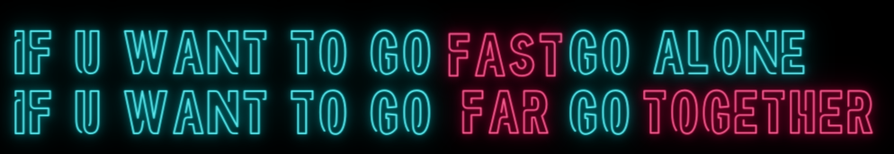

  

## 
I'm Fabi.

---

### Something About

- Pronouns: she/her
- Ask me about roller derby, crossfit and korean crime tv shows.
- Backend Developer(Go/Golang) at Latin America's largest e-commerce platform
- Former Java/Kotlin Developer - Developed backend solutions for financial systems, with experiences in banking and fintech environments
- PostGraduate in GO at Fullcycle
- Currently pursuing a MBA Software Engineering with AI degree

---

### My GitHub Stats

<!-- Resources -->
<!-- Icons: https://simpleicons.org/ -->
<!-- GitHub Stats: https://github.com/anuraghazra/github-readme-stats -->
<!-- Shields: https://shields.io/ -->
<!-- Awesome GitHub Profile README: https://github.com/abhisheknaiidu/awesome-github-profile-readme -->
